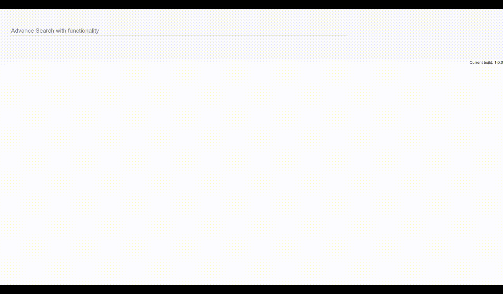

# Query based Autocomplete in Angular ( like JQL in Jira)

The feature is like to have a textbox which keep autopopulating the suggestions 
[Field + Operator + Value] + (Keyword) + ... 
Eg - Name = 'Technosaviour' OR Age > 2 
 
The autocomplete should give suggestion of fields like [Name, Age] 
Then [=, >, <, >=, etc] 
Then [Techno, Saviour, Technosaviour] 
Then the autocomplete should suggest [And, Or] 
# Installation and Usage
USAGE 
npm install 
npm start 
browse - http://localhost:4200  
# Demo

